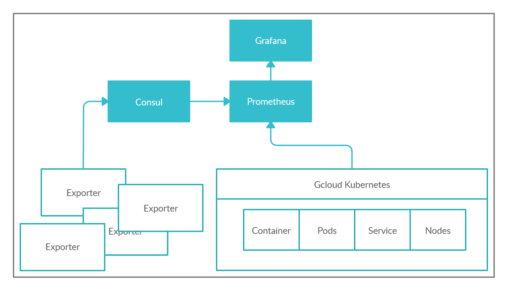
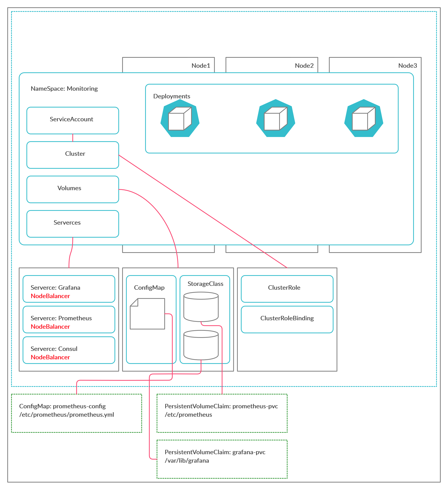

# Monitoring-k8s



This repository uses some monitoring tools in a modular way to collect metrics and logs from network, hosts, containers and applications.

## Infrastructure

- Google Cloud
    - Instâncias VM
    - Docker
    - Kubernetes
- Concentrator Mikrotik
    - PPPoE
    - DHCP
- Exporters
    - Mikrotik
    - Linux
    - Services

## Services e Application

- Prometheus
- Consul
- Grafana

Cloned the repository
```
# git clone https://github.com/madson7/monitoring-k8s.git
# cd monitoring-k8s
```

## Kubernetes Gcloud



```
# kubectl apply -f config\
# kubectl apply -f prometheus\
# kubectl apply -f consul\
# kubectl apply -f grafana\
```
As we are using NodePort, we will expose the same
```
# gcloud compute firewall-rules create NAME --allow tcp:Port
```

## Mikrotik Config

Create a user on the device that has API and read-only access.
```
# /user group add name=prometheus policy=api,read,winbox
```

Create the user to access the API via.
```
# /user add name=prometheus group=prometheus password=12345678
```
## Consul Config
```
# curl -T mk.json http://34.71.71.92:30085/v1/agent/service/register
```

## Nodes Exporters Config
```
# ./mikrotik-exporter -config-file config.yaml
```


falta muito kkk